*# Challenge: misc/web-crypto
> Everyone knows W in web stands for crypto, so I made this totally secure secret collection.

> https://web-crypto.1337.sb/

> author: cpp.dog

## Initial look
We are given a webpage with few `secrets`: 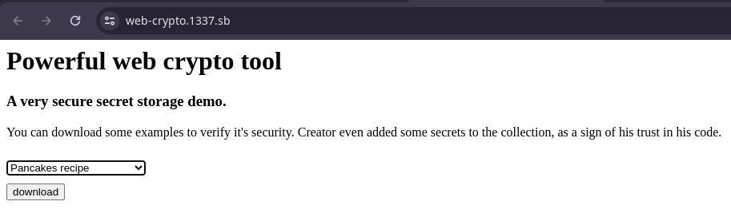

On clicking `download` it makes a POST request to `/collection`

Here is the complete request for reference:
```bash
curl 'https://web-crypto.1337.sb/collection' \
  -H 'accept: text/html,application/xhtml+xml,application/xml;q=0.9,image/avif,image/webp,image/apng,*/*;q=0.8,application/signed-exchange;v=b3;q=0.7' \
  -H 'accept-language: en-US' \
  -H 'cache-control: max-age=0' \
  -H 'content-type: application/x-www-form-urlencoded' \
  -H 'origin: https://web-crypto.1337.sb' \
  -H 'priority: u=0, i' \
  -H 'referer: https://web-crypto.1337.sb/' \
  -H 'sec-ch-ua: "Not/A)Brand";v="8", "Chromium";v="126", "Google Chrome";v="126"' \
  -H 'sec-ch-ua-mobile: ?0' \
  -H 'sec-ch-ua-platform: "Linux"' \
  -H 'sec-fetch-dest: document' \
  -H 'sec-fetch-mode: navigate' \
  -H 'sec-fetch-site: same-origin' \
  -H 'sec-fetch-user: ?1' \
  -H 'upgrade-insecure-requests: 1' \
  -H 'user-agent: Mozilla/5.0 (X11; Linux x86_64) AppleWebKit/537.36 (KHTML, like Gecko) Chrome/126.0.0.0 Safari/537.36' \
  --data-raw 'secret=secret'
```

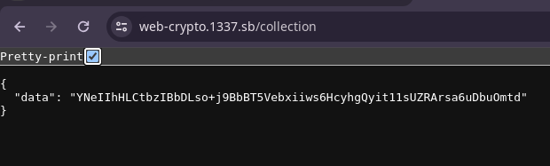

Response: ```{"data":"2J7FfeZP9l19Y6DnQSPGceisSiy6A3SJJXC5RKkFMWhI+Qq/qkeCxIOQqyF7ikis"}``` 

# Lets dive into the source code

Since main.go is the entry point for any GoLang application, I started from there as well.
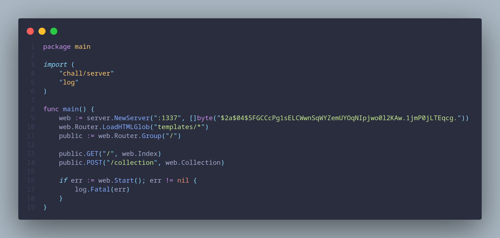

Seeing the bcrypt hash ```$2a$04$5FGCCcPg1sELCWwnSqWYZemUYOqNIpjwo0l2KAw.1jmP0jLTEqcg.```, my first thought was head over to [CrackStation](https://crackstation.net/)

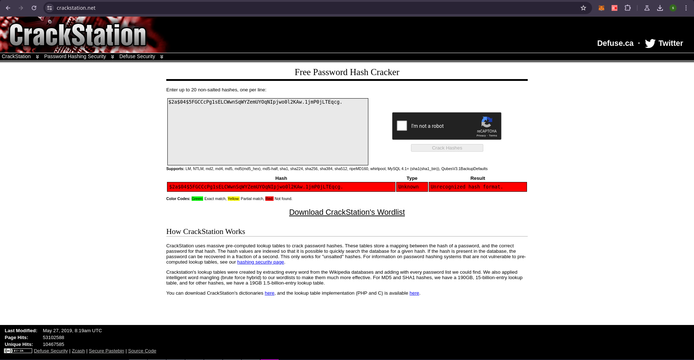

But it was not able to find any results. I thought about bruteforcing this myself,
but before I start to bruteforce lets actually see if this bcrypt is being used as a password or soeme other sensitive data or its just a rabbit hole.

Lets continue navigating through the source code. Inside server.go, I can see there is a server being created using the gin framework.

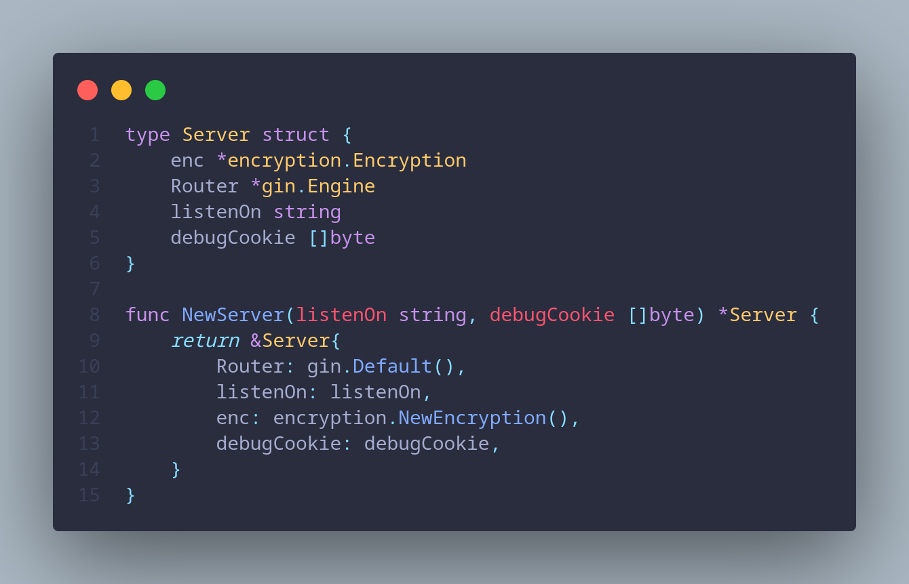

This confirms that the bcrypt hash we found in cmd/main.go is being used as a debugcookie for the server. It needs cracking! :) 

But first lets continue walking through the code. Back in cmd/main.go I am able to see 

```go
	public.GET("/", web.Index)
	public.POST("/collection", web.Collection)
``` 

Inside server/endpoints.go, in the POST form body `secret` is being passed. We can also confirm this from our initial POST `/collection` request dump. But there is `DEBUG` cookie that was not initially present in the request dump, and it looks like `DEBUG` cookie is being compared with the bcrypt hash after it is formatted for ex. if we send a `DEBUG=test` cookie then it will be formatted to `DEBUG_test_DEBUG`.

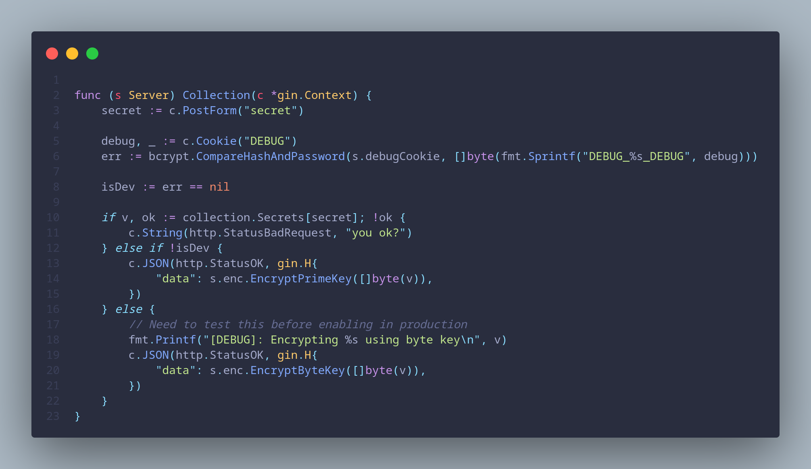

```go
    err := bcrypt.CompareHashAndPassword(s.debugCookie, []byte(fmt.Sprintf("DEBUG_%s_DEBUG", debug)))
```

Upon further reading through the `Collection` function, I can see that if we are successfully able to pass the bcrypt comparison then `isDev` parameter will be true else it will remain false. Here I saw that there was a debug log being printed `fmt.Printf("[DEBUG]: Encrypting %s using byte key\n", v)` which shows the plaintext before actually encrypting it and I misunderstood this and thought this will print on the browser console but either way, it was time to crack the debugcookie now.

Heading over to hashcat, I created a `hashes.txt` file with just the bcrypt hash in it and using the rockyou wordlist I began cracking the hash. 
```bash
    hashcat --m 3200 -a 0 hashes.txt /opt/SecLists/Passwords/Leaked-Databases/rockyou.txt
```

But after viewing the passwords hashcat was trying to brute force the bcrypt hash with, it struck me these are not formatted correctly.

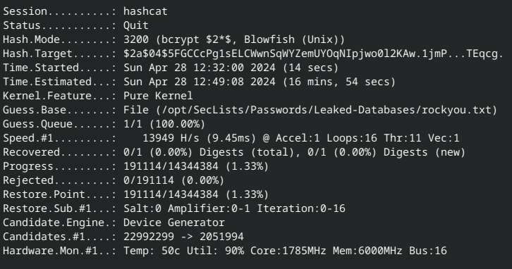

After a bit of googling I came across `-r rules.rule` parameter in hashcat. This was particularly used to format the passwords before bruteforcing.
I asked ChatGPT for initial rules.rule file to format passwords in `DEBUG_<pass>_DEBUG` format, 
```
    ^D^E^B^U^G^_
    $_$D$E$B$U$G
```

This format was a bit wrong and after a small _debugging_ session with hashcat I was able to get correct rule: ```^_^G^U^B^E^D$_$D$E$B$U$G```

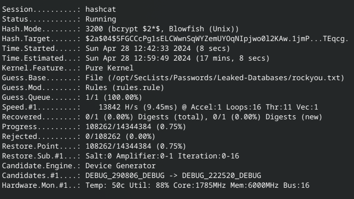

Now it was just time to run hashcat and let it do its thing. I added --status-timer so that hashcat prints the status every 2 seconds.
```bash
    hashcat --status --status-timer 2 -m 3200 -a 0 -r rules.rule hashes.txt /opt/SecLists/Passwords/Leaked-Databases/rockyou.txt
```

Hashcat was able to crack the bcrypt hash and the `DEBUG` cookie we need to set was `camchito`.

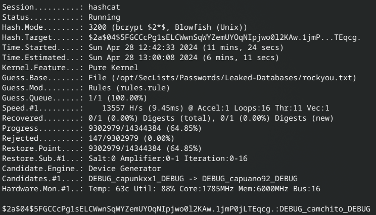

After digging through templates/index.html I can see I cannot select the `flag` secret that was mentioned in collection/collection.go via webpage.

```
    var Secrets = map[string]string{
    	"fanfic":                      "REDACTED",
    	"very-secret-totaly-not-flag": "REDACTED",
    	"secret":                      "REDACTED",
    	"gnu-linux":                   "REDACTED",
    	"recipe":                      "REDACTED",
    	"flag":                        "REDACTED",
    }
```

So I update the curl request and also add the `DEBUG=camchito` cookie to the POST `/collection` request.

```bash
curl 'https://web-crypto.1337.sb/collection' \
  -H 'accept: text/html,application/xhtml+xml,application/xml;q=0.9,image/avif,image/webp,image/apng,*/*;q=0.8,application/signed-exchange;v=b3;q=0.7' \
  -H 'accept-language: en-US' \
  -H 'cache-control: max-age=0' \
  -H 'content-type: application/x-www-form-urlencoded' \
  -H 'cookie: DEBUG=camchito' \
  -H 'origin: https://web-crypto.1337.sb' \
  -H 'priority: u=0, i' \
  -H 'referer: https://web-crypto.1337.sb/' \
  -H 'sec-ch-ua: "Not/A)Brand";v="8", "Chromium";v="126", "Google Chrome";v="126"' \
  -H 'sec-ch-ua-mobile: ?0' \
  -H 'sec-ch-ua-platform: "Linux"' \
  -H 'sec-fetch-dest: document' \
  -H 'sec-fetch-mode: navigate' \
  -H 'sec-fetch-site: same-origin' \
  -H 'sec-fetch-user: ?1' \
  -H 'upgrade-insecure-requests: 1' \
  -H 'user-agent: Mozilla/5.0 (X11; Linux x86_64) AppleWebKit/537.36 (KHTML, like Gecko) Chrome/126.0.0.0 Safari/537.36' \
  --data-raw 'secret=flag' 
```

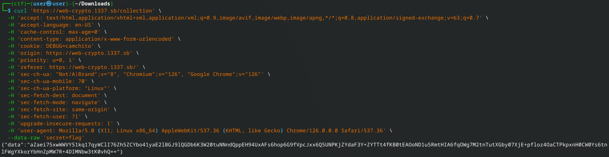

Here `aZaei75xwWWVY51kq17qyWClI76Zh5ZCYbo41yaE2lBGJ9lQGDb6K3W20tuNNndQppEH94UxAFs6hop6G9fVpcJxx6Q5UNPKjZYdaF3Y+ZYTTt4fKB0tEAOoND1u5RmtHIA6fqOWg7M2tnTutXGby07XjE+pfloz4OaCTPkpxnH0CW0Ys6tnlFWgYXkorYbHnZpMW7R+4DIMNbw3tK0vhQ==` was returned as an encrypted flag. But no `[DEBUG]` log was printed obviously. Here I had a gotcha moment and figured that it was a server log and I have no way of accessing it.

Moving on, back in `Collections` function inside server/endpoints.go I saw that the flag can be encrypted with two different methods depending upon whether we send the correct `DEBUG` cookie or not.

So just for comparison I also fetched the encrypted flag without the debug cookie: `HmhqyMJYHWS4SEXoDvhDJ5iwtFfiFJXwaf1jSkVE0ENfHrWIGGiL8drk0ZWFJlmAynsAqaIKTMhspMbWBMP/5Hx/3iwCHbCYyJJhYdX7J5y9veQmiiQnVQLjv7ijTX2jPNSpET8sok6YPBh8BL/W9OJ5FQHkJXRGK2ETnYQjW8lYIybMTqTVFXxMi2sR8nH8Fmqgm1nJN53yA67KgtMhPA==`

# Its time to look into cryptography

Here I begin looking into the encryption folder to figure out how to decrypt the flag.
In crypto/byte_key.go there is a vulnerability related to improper use of pointers leading to unintended data sharing.

```go
    for _, bi := range ba {
        // Avoid copying to speed this up, cuz algorithm takes a lot of time as security pay off 
        res[i] = &bi
        i++
        if i == keyLength*256{
            break
        }
    }
```
Lets see what Copilot has to say about this vulnerability:
```
Description:
The vulnerability lies in the improper use of pointers in the Go language. In the loop where the bi variable is assigned to res[i], the same memory address is being assigned to all elements of res. This is because &bi gets the address of bi, and since bi is reused in each iteration, all elements in res end up pointing to the same memory location.

Impact:
This means that all elements in res will always have the same value, which is the value of the last byte read from rand.Read(ba). This significantly reduces the randomness and security of the generated key, making it easier for an attacker to predict or brute force the key.
```

Also, I confirmed this with CTF admins and this was the right track and not just a rabbit hole.

Lets recap the cryptographic vulnerability:

- The `ByteKey.Generate` function has a vulnerability related to the improper use of pointers in Go. Instead of storing the actual byte values in the `res` slice, it stores the memory addresses of a single `bi` variable, causing all elements in `res` to point to the same memory location.

- This vulnerability compromises the security of the encryption scheme that uses the `ByteKey` type. Instead of generating a unique key for each encryption operation, it effectively uses the same key for all encryptions, making it trivial to decrypt the ciphertexts.

- The vulnerability affects the `EncryptByteKey` function, which uses the vulnerable `ByteKey.Generate` function to generate keys.

- The `EncryptPrimeKey` function is not affected by this vulnerability because it uses the `PrimeKey.Generate` function, which does not have the same issue with pointers.

- The reason why the `PrimeKey.Generate` function is not affected is that it correctly creates a new `PrimeKeyUnit` (a `big.Int`) for each element of the `res` slice, avoiding the issue of assigning the same memory address to multiple elements.

# Solution

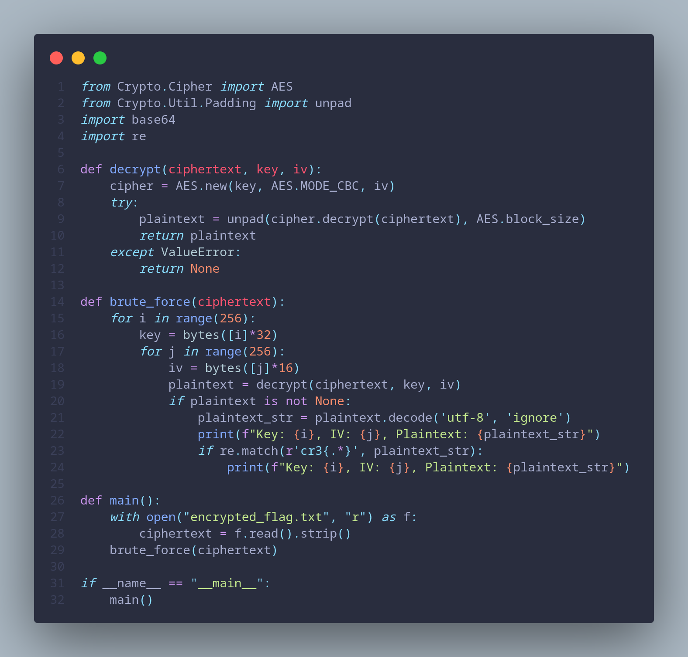

The given python script will get flag secret from POST `/collections` with debugcookie as `camchito`. Parse the response and base64 decode it.

It then tries all possible 32-byte keys (256 possibilities) by iterating over values from 0 to 255 and creating a byte array of length 32 with the same value repeated 32 times. Since the vulnerable ByteKey.Generate function also generates keys with repeated byte values, the correct key used for encryption is guaranteed to be present in the range of keys being tried by the brute-force script.

The script also tries all possible 16-byte IVs (256 possibilities) by iterating over values from 0 to 255 and creating a byte array of length 16 with the same value repeated 16 times. This ensures that the correct IV used for encryption is also covered in the brute-force attempt.

```bash
    python3 solve.py > decrypted_text.txt
```

NOTE: Save the script output to a text file, to avoid non-ascii characters causing terminal issues.

`Found Flag: cr3{s0o_uhHh_1_w4nna_s4y_h3l10_t0_my_m0m_s1st3rs_g1rlfr13nd(j0k3_1_d0nt_have_4ny)_d0g_c4t_p3t_c0ckr04ch_and_y0u_th3_p3rs0n_wh0_s0lv3d_th15_ch4l1eng3}
`

I actually was the first to solve this. Many thanks to the CTF Admins for being so supportive without spoiling the fun of solving the challenge.

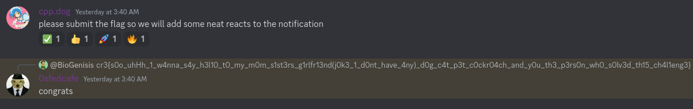

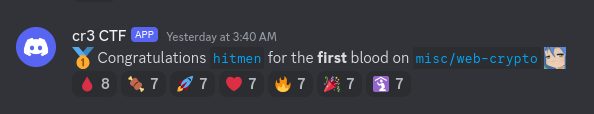*